<h1 align="center"> mgm-server </h1>  

    <picture>
        
    </picture>

  Spring Boot Web App

<!--      <picture>
        
    </picture> -->
    <picture>
        
    </picture>
     <picture>
        
    </picture>
     <picture>
        
    </picture>
    <picture>
        
    </picture>
    <picture>
        
    </picture>

[https://mrgrassmaster.com](https://mrgrassmaster.com)

<!-- Heading end-->

<!-- Contents start-->

## Contents

- [Backlog](#backlog)
- [Description](#desc)
- [Spring Boot](#spring_boot)
- [Logging](#screenshots)
- [Testing](#testing)
- [Hosting](#hosting)
- [Demo](#demo)

<!-- Contents end-->

## Backlog

- [X]  Add new endpoints
- [X]  Remove redundant endpoints
- [X]  Unit testing
- [ ]  Deploy

## Description

First attempt at client server architecture - been developing it on/off since 2022. 

<ul>
	<li>Client uses Angular</li>
		<ul>
			<li>mgm-client</li>
		</ul>
	<li>Server uses Spring Boot</li>
		<ul>
			<li>mgm-server</li>
            <li>local postgres database</li>
		</ul>
 	<li>Previous hosted on AWS</li>
</ul>

## Spring Boot details

Application is stateless - user details stored on a database

- Custom Authentication

  - `CustomUsernamePasswordFilter` extracts username/password from HTTP request body
  - `CustomUserDetailsServer` checks user details by quering the database
  - `CustomAuthenticationProvider` authenticates user and adds user authorities/priviledges
      
- **Login Authorization**

  - Handled by Spring Security
    - Requires user authority role ADMIN
    - HTTP response contains a JWT cookie
        
- **Custom Authorization**

  - Verifies user details extracted from JWT cookie
    - `JwtAuthenticationFilter` validates the cookie and extracts user details
    - Proceeds with custom authentication
        
- **Custom JWT Cookies**

  - Creates a JWT cookie using the username and appends it to the HTTP response
    - `JwtUtility` creates response cookie
        
- **Custom Logging**

  - Logs all HTTP requests to file
  - Logs successful authentication attempts
  - Logs errors sent by the Angular client to file angular.log
    - `Logback`
        
- **Injection attack mitigation**

  - `HTML/JavaScript injection` form input is sanitised to remove HTML/JavaScript
  - `SQL Injection` input is inserted into the database as String parameters
      
- **Database**

  - `postgresl` used to store data - contact forms, user details
  - `h2` in memory database used for testing
      
- **Custom HTTP request caching**

  - Caches content type application/json requests to prevent IllegalStateException: “getInputStream() has already been called for this request.
      
- **Custom Header Filter**

  - Adds custom HTTP response headers to the http-response - required by Angular front-end
      

## Hosting

Previously hosted on AWS ec2 - no longer 
AWS Route53 routes requests for server.mrgrassmaster.com to the instance

- **ec2 details**
  - instance type t3a.micro
    - `ubuntu`
        
- **Install packages**
  - `openjdk-17-jdk`, `tomcat`, certbot
      
- **Add files**
  - add Spring war file and SSL certificate files
      
- **tomcat configuration**
  - enable ssl
  - ssl certificate and key
  - java war file
      
- **Configure firewall**
  - enable ssh, http, https, database port

## Logging

- **Uses `logback` **
  - Spring Boot (mgm-server) to all.log
    - log exceptions, HTTP-requests, login attempts
  - Angular (mgm-client) to angular.log sent via HTTP request
      

    <picture>
        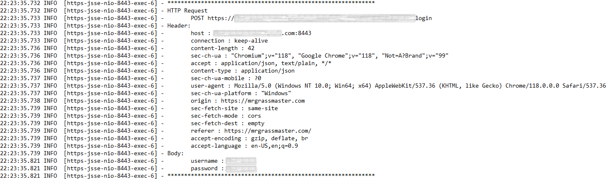
    </picture>

HTTP request from mgm-client

## Testing

- **Unit Tests **

    <picture>
        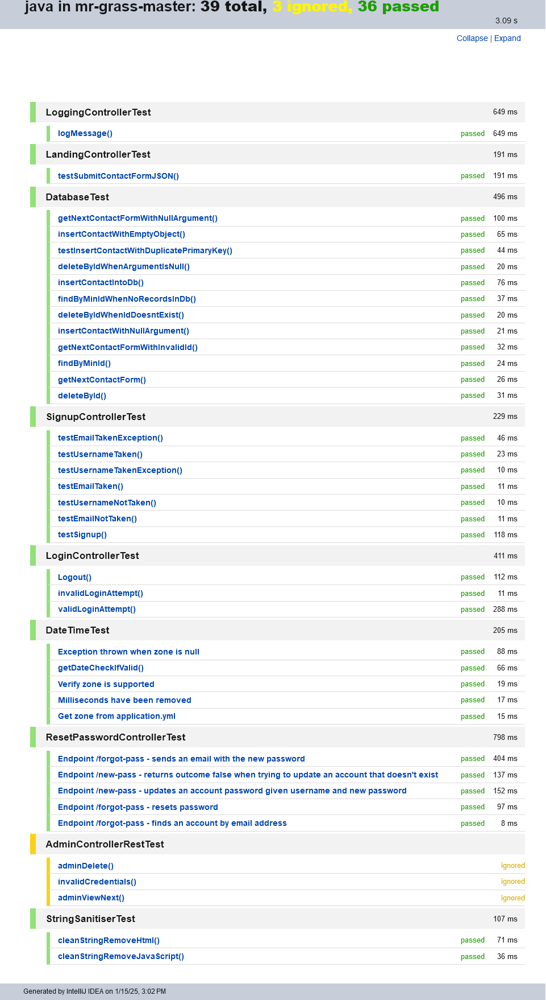
    </picture>

## Demo

#### Development user testing on localhost

<ul>
    <li>server port 8080</li>
    <li>Postgres port 5432</li>
    <li>client port 80</li>
</ul>

## `Landing page`

[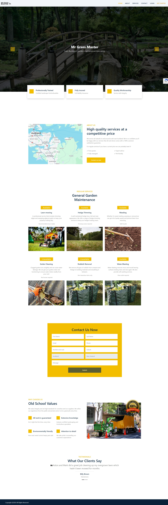](readme/demo/landing.jpeg)
 

#### `Contact form validation`

[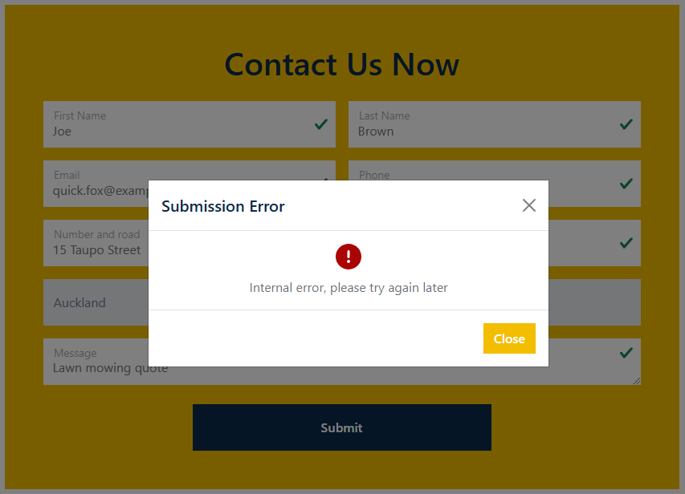](readme/demo/contact-validation.png)

#### `Error submitting contact form`

#### `Successfully submission`

#### `Server writes record to database`

[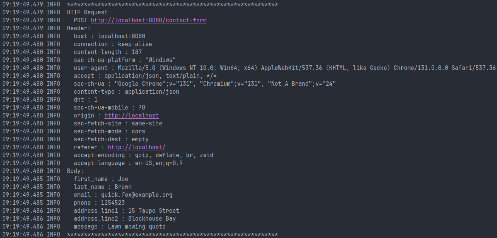](readme/demo/http-contact.png)
[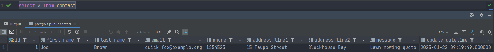](readme/demo/database-contact.png)

## `Signup form`

#### `Form validation`

[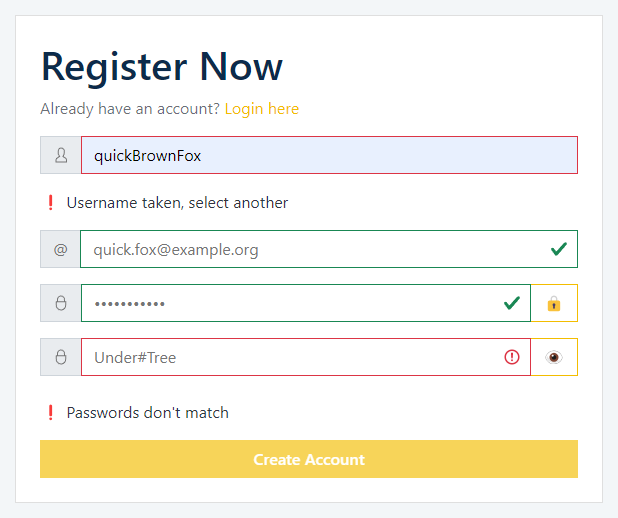](readme/demo/register-validation.png)

#### `Request to check if username is taken`

[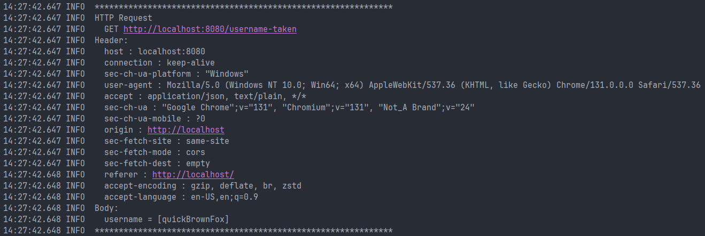](readme/demo/http-username.png)

#### `Unsuccessful submission`

[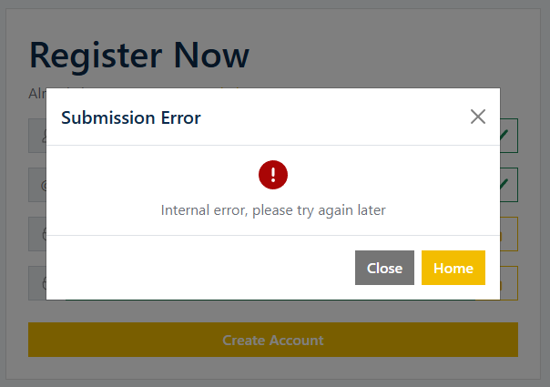](readme/demo/register-error.png)

#### `Successful submission`

[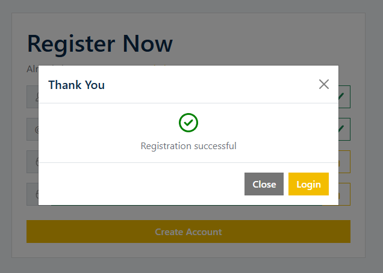](readme/demo/register-success.png)

#### `Record written to database`

[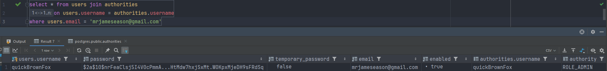](readme/demo/database-register.png)

## `Forgot Password`

#### `Enter email to receive one-time password`

[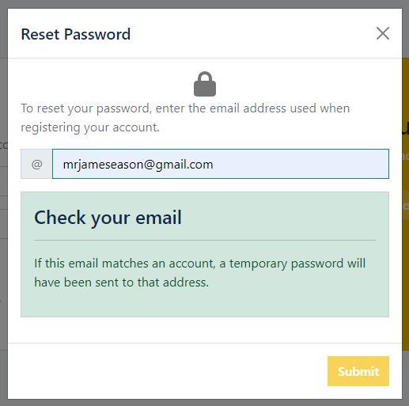](readme/demo/forgot-password-email.png)

#### `Password received`

[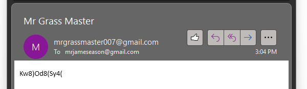](readme/demo/temporary-password.png)

#### `Sets accounts temporary attribute true (indicates password is temporary)`

[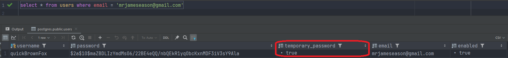](readme/demo/database-temporary-true.png)

#### `Attempting to login with one-time password prompts user to change it`

[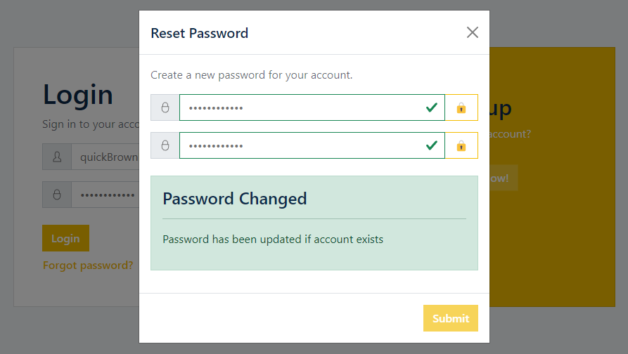](readme/demo/new-password.png)

#### `Resetting password sets temporary false (indicates password is not temporary)`

[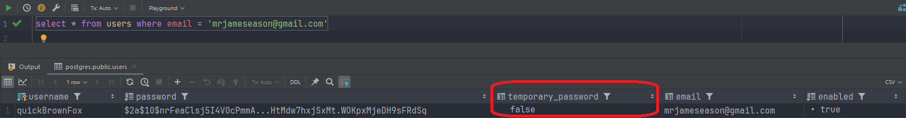](readme/demo/database-temporary-false.png)

#### `Successfully logged into a dashboard`

[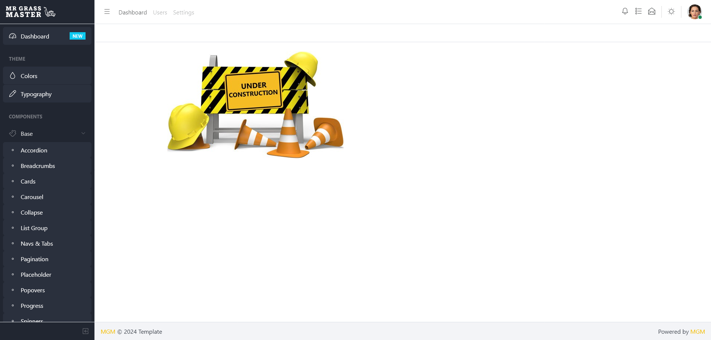](readme/demo/dashboard.png)
