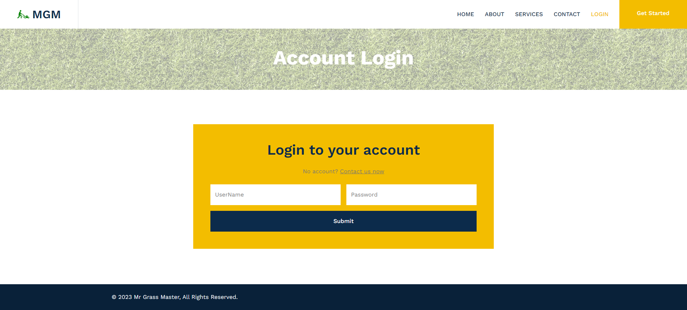
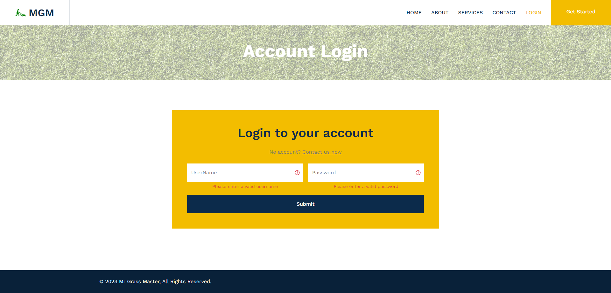
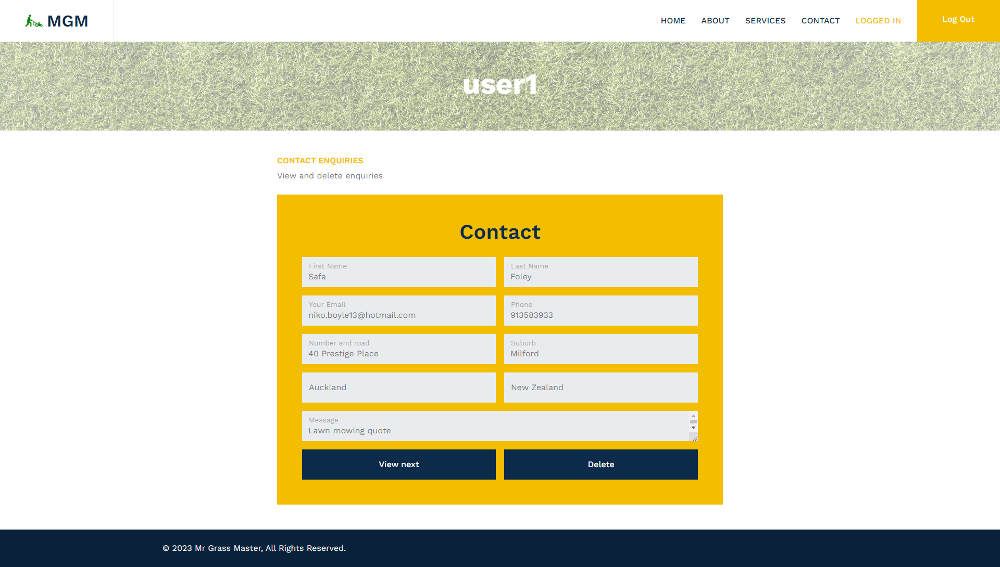
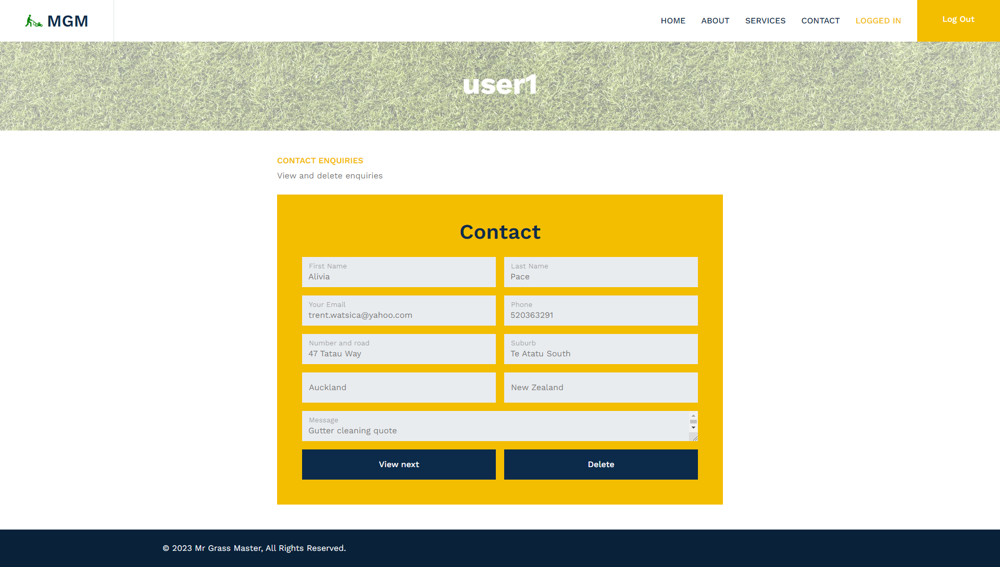

<h1 align="center"> MrGrassMaster </h1>  

    

  Spring Boot Web App

    
    
    

## Contents

- [Demo](#demo)
- [Description](#description)
- [Dependencies](#dependencies)
- [Learning interesting stuff](#interesting)
- [screenshots](#screenshots)
- [Backlog](#contributors)
- [Version](#build-process)

## Demo 

[http://m-g-m.ap-southeast-2.elasticbeanstalk.com](http://m-g-m.ap-southeast-2.elasticbeanstalk.com)

## Description 

- **Hosting**
    - Amazon Web Services
      - `AWS Elastic Beanstalk` running JAR
      - `AWS RDS` running Postgres database
          
- **Contact Us Form**
    - Prevention against attacks
        - `HTML/JavaScript injection` form input is sanitised to remove HTML/JavaScript.
        - `SQL Injection` input is inserted into a database as String parameters.
            
- **Login Page**
    - Authentication/authorization
        - `authentication` verified by UserNamePasswordAuthenticationFilter.
        - `password encoding`  encoded/decoded using BCryptPasswordEncoder.
        - `authorization` verified by AuthorizationFilter.
        - `login redirects` admin users are redirected to /admin page by a custom LoginSuccessHandler.
            
- **Admin Page**
    - View/delete submitted 'Contact Us' forms
        - `view forms` authorised users can iterate through forms which are retrieved from the database.
           

        - `delete forms` authorised user can delete forms which deletes them from the database.
           
        - `logout` redirects the user to the /index page.

## Dependencies/Libraries 

- **`Spring Boot`**
    - various dependencies e.g. spring-boot-starter-web
- **`Spring Security`**
    - authentication, authorization and attack mitigation
- **`Hibernate`**
    - interacting with the database
- **`PostgreSql`**
    - external database which stores 'Contact Us' form data
- **`H2`**
    - embedded database for development/testing
- **`Hamcrest` `Mockito` `MockMvc`**
    - used in unit/integration testing
- **`JSoup`**
    - form input sanitisation to remove HTML/JavaScript
- **`Logback`**
    - logging events to file

## Learning Interesting Stuff 

**Viewing all incoming HTTP Requests**

Implemented using a custom Spring Security Filter which logged request header/body data.
~~~
HEADER:
    host:localhost:8080
    connection:keep-alive
    content-length:263
    cache-control:max-age=0
    sec-ch-ua:"Not/A)Brand";v="99", "Google Chrome";v="115", "Chromium";v="115"
    sec-ch-ua-mobile:?0
    sec-ch-ua-platform:"Windows"
    upgrade-insecure-requests:1
    origin:http://localhost:8080
    content-type:application/x-www-form-urlencoded
    user-agent:Mozilla/5.0 (Windows NT 10.0; Win64; x64) AppleWebKit/537.36 (KHTML, like Gecko) Chrome/115.0.0.0 Safari/537.36
    accept:text/html,application/xhtml+xml,application/xml;q=0.9,image/avif,image/webp,image/apng,*/*;q=0.8,application/signed-exchange;v=b3;q=0.7
    sec-fetch-site:same-origin
    sec-fetch-mode:navigate
    sec-fetch-user:?1
    sec-fetch-dest:document
    referer:http://localhost:8080/form
    accept-encoding:gzip, deflate, br
    accept-language:en-US,en;q=0.9
    cookie:Idea-c1035a9b=3a68ec60-852b-4005-a4ef-e4c243ce1df1; JSESSIONID=E3888E4060FADEF1E201639266E76AFD
BODY:
    _csrf=[yJwud5V0wzH2VT2UMXcrelxuW6FUmzp6kARNAMsAfOesM1bFrKxLQ_BC9lTbYA2iUFofSGVadsMx-QtXpWd1OPk2TYWeV2D3]
    first_name=[Billy]
    last_name=[Brown]
    email=[billy@gmail.com]
    phone=[022 546 8888]
    address_line1=[16 Pinero Place]
    address_line2=[Bucklands Beach]
    message=[Lawnmowing quote]
~~~

## Screenshots

**Index**
 

**Login**
 

**Invalid Login**
 

**Admin**
 

**View Next Contact Form**
 

**Delete Contact Form**
 

## Backlog
- [ ] Contact form submission confirmation
- [ ] Brute force attack mitigation by recording IP addresses
- [ ] A page for authenticated users with authority USER
- [ ] Signed SSL certificate and HTTPS redirect

## Version
1.0 PHP 
2.0 Java
